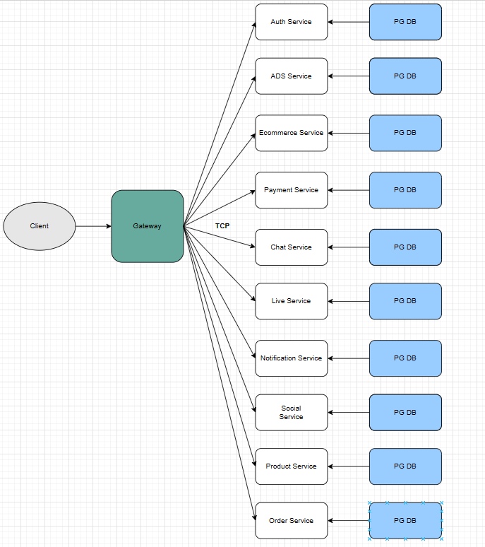

# social microservices project NestJS and gRPC
- Docs
## Install Package and start project
### environment
- Nodejs -version: 18.16.0
- npm -version: 9.5.1
- 
### install
- Clone: `$ git clone https://github.com/devhoangkien/social-microservices.git`
- Install package: `cd social-microservices && yarn install-all || npm run install-all`
- docker: `yarn build `, `docker compose up`

## Directory structure 
``` shell
- app/
  - _proto
  - apps/
    - auth-svc/
      - src/
        - _proto
        - config
        - database
        - middleware
          - exception
          - guards
          - interceptor
        - models
          - user.entity.ts
          ...
        - modules
          - auth/
            - auth.controller.ts
            - auth.module.ts
            - auth.service.ts
          - roles/
            - roles.controller.ts
            - roles.module.ts
            - roles.service.ts
          - permissions/
            - permissions.controller.ts
            - permissions.module.ts
            - permissions.service.ts
        - shared
          - exception
            - exception.enum.ts
            - index.ts
        - app.controller.ts
        - app.module.ts
        - app.service.ts
        - main.ts
      - test/
      - Dockerfile
      - package.json
      - ...
    - payment-svc
      - ...
    - ...
    - user-svc
      - ...
  - gateway/
    - src/
      - auth/
        - auth.module.ts
        - auth.controller.ts
        - auth.interface.ts
      - app.controller.ts
      - app.module.ts
      - app.service.ts
      - main.ts
    - test/
    - ...
  - docs/
  - scripts/
  - shared/
      - utils
        - password.utils.ts
  - docker-compose.yml
  - package.json
```


